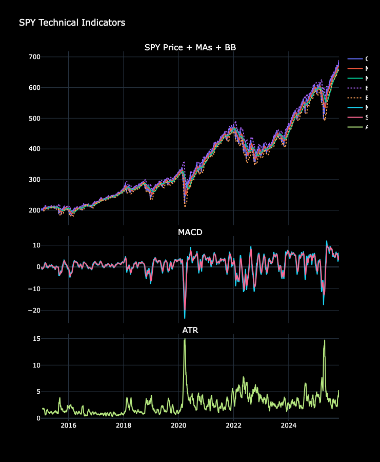

# ML Financial Optimization: Machine Learning for Asset Pricing & Portfolio Optimization

> A comprehensive research framework exploring reinforcement learning, inverse optimization, and neural pricing kernels for quantitative finance.

This repository implements three interconnected essays on machine learning applications in portfolio optimization and asset pricing:
- **Essay 1**: Disaster-aware portfolio allocation with SARSA and importance sampling
- **Essay 2**: Inverse optimization of state-dependent risk aversion combined with deep RL
- **Essay 3**: Neural network pricing kernel (SDF) for nonlinear cross-sectional pricing

---

## Visualizations & Analysis

All visualizations are generated using OpenBB Platform, showcasing comprehensive market analysis, technical indicators, and risk metrics.

### Market Dashboards

Comprehensive dashboards for major ETFs showing price action, volume, returns, and technical indicators.

#### SPY (S&P 500 ETF)


#### QQQ (Nasdaq 100 ETF)


#### IWM (Russell 2000 ETF)


#### EFA (International Developed Markets)


#### GLD (Gold ETF)


#### TLT (20+ Year Treasury Bond ETF)


---

### Technical Analysis

#### SPY Technical Indicators
Moving averages, MACD, Bollinger Bands, and ATR analysis:


#### Candlestick Charts with Overlays

**SPY Candlesticks with MA and Bollinger Bands:**


**QQQ Candlesticks (Full View):**


**QQQ Candlesticks (Zoomed Detail):**


---

### Risk & Performance Metrics

#### Cumulative Returns Comparison
Multi-asset cumulative performance visualization:


#### Correlation Heatmap
Asset correlation matrix showing diversification opportunities:


#### Rolling Sharpe Ratio & Volatility
60-day rolling risk-adjusted returns and volatility metrics:


#### Drawdown Analysis
Maximum drawdown periods across assets:


---

## Project Structure

```
ml-financial-optimization/
│
├── main.py                    # Optional CLI for running essays
├── streamlit_app.py           # Single-page Findings app
│
├── src/
│   ├── essay1_sarsa_is.py     # Essay 1 driver (SARSA-IS)
│   ├── essay2_inverse_rl.py   # Essay 2 driver (inverse opt + deep RL)
│   ├── essay3_nn_pricing.py   # Essay 3 driver (NN SDF)
│   │
│   ├── algorithms/
│   │   ├── sarsa_is.py        # SARSA with importance sampling (core updates)
│   │   └── inverse_opt.py     # Inverse mean-variance risk-aversion estimation
│   │
│   ├── data/
│   │   └── data_loader.py     # Data fetching and preprocessing
│   │
│   ├── environments/
│   │   └── portfolio_env.py   # Portfolio environment (returns, features)
│   │
│   ├── optimization/
│   │   └── mean_variance.py   # Mean-variance utilities
│   │
│   └── utils/
│       ├── visualizations.py  # Plotly/Matplotlib figures (OpenBB/yfinance/Stooq fallbacks)
│       └── openbb_viz.py      # Convenience wrappers around OpenBB
│
├── visualizations/
│   ├── essay1/                # Exported PNGs for Essay 1
│   ├── essay2/                # Exported PNGs for Essay 2
│   └── essay3/                # Exported PNGs for Essay 3
│
├── notebooks/
│   ├── Visualizations/        # OpenBB comprehensive analysis visualizations
│   └── OpenBB_Comprehensive_Workbench.ipynb  # Interactive market analysis notebook
│
├── data/
│   ├── raw/                   # Raw inputs (e.g., market_data_*.csv)
│   ├── processed/
│   └── results/
│
├── essay3_nn.png              # Neural network SDF schematic image
├── requirements.txt           # Python dependencies
└── README.md                  # This file
```

---

## Setup

**Prefer Python 3.11** to avoid macOS BLAS/SSL issues.

```bash
# Clone the repository
git clone <repo-url>
cd ml-financial-optimization

# Create a fresh virtual environment (recommended)
/Library/Frameworks/Python.framework/Versions/3.11/bin/python3 -m venv .venv
source .venv/bin/activate
python -m pip install --upgrade pip

# Install dependencies
python -m pip install -r requirements.txt || true
python -m pip install "streamlit==1.32.2" "plotly==5.22.0" "pandas==2.0.3" "numpy==1.26.4" \
  "matplotlib>=3.8" "seaborn>=0.13" "yfinance>=0.2.40" "pandas-datareader>=0.10.0"
```

### OpenBB Platform Installation

For comprehensive market analysis and visualizations, install OpenBB Platform:

```bash
pip install "openbb>=4"
```

**Notes:**
- OpenBB SDK requires Python ≥3.10
- On macOS floating‑point crashes, set:
  ```bash
  export KMP_DUPLICATE_LIB_OK=TRUE OMP_NUM_THREADS=1 MKL_NUM_THREADS=1 \
    OPENBLAS_NUM_THREADS=1 VECLIB_MAXIMUM_THREADS=1 NUMEXPR_NUM_THREADS=1
  ```

---

## Quick Start

### Run the Findings App

```bash
source .venv/bin/activate  # if using the venv
export KMP_DUPLICATE_LIB_OK=TRUE
python -m streamlit run streamlit_app.py --server.address 127.0.0.1 --server.port 8501
```

The app:
- Explains the motivation and methods for each essay
- Renders exported PNGs from `visualizations/essay1-3`
- Shows code excerpts of core modules
- Displays a neural‑network SDF schematic (`essay3_nn.png`)

### Explore Market Analysis Notebook

Open `notebooks/OpenBB_Comprehensive_Workbench.ipynb` for interactive analysis:
- Real-time market data fetching
- Technical indicator computation
- Risk metric visualization
- Multi-asset comparison

---

## Essays Overview

### Essay 1 — SARSA with Importance Sampling (SARSA‑IS)

**Focus**: Disaster-aware portfolio allocation using on-policy reinforcement learning.

- **Algorithm**: On‑policy SARSA with importance sampling to emphasize disaster regimes
- **Features**: Reward shaping and drawdown‑aware features for stability
- **Validation**: Cumulative returns, drawdowns, and training metrics

**Key Innovation**: Handles rare disaster events by upweighting their importance in the learning process.

### Essay 2 — Inverse Optimization + Deep RL

**Focus**: Inferring investor risk preferences from observed portfolio choices.

- **Method**: Inverse mean-variance optimization to estimate state‑dependent risk aversion
- **Integration**: Regularizes actor‑critic RL toward economically consistent actions
- **Validation**: Convergence of parameters and stable performance across market regimes

**Key Innovation**: Bridges revealed preference theory with modern deep RL for robo-advising.

### Essay 3 — Neural Pricing Kernel (SDF)

**Focus**: Neural network-based stochastic discount factor for nonlinear asset pricing.

- **Model**: Shallow neural network for the SDF with optional positivity constraints
- **Normalization**: Enforces E[m·R_rf]≈1 for economic consistency
- **Evaluation**: Quadratic pricing errors and factor importance analysis

**Key Innovation**: Captures nonlinear pricing relationships that linear factor models miss.

---

## Data & Visualizations

### Data Sources

- **Raw Data**: Market data CSVs in `data/raw/`
- **Processing**: Automated preprocessing and feature engineering via `src/data/data_loader.py`
- **Caching**: Intelligent caching to minimize API calls

### Visualization Pipeline

- **Primary**: OpenBB Platform for professional-grade market data and charts
- **Fallbacks**: yfinance and pandas-datareader for robustness
- **Output**: High-resolution PNG exports to `visualizations/` and `notebooks/Visualizations/`

All visualizations are generated using `src/utils/visualizations.py` with support for:
- Interactive Plotly charts
- Publication-ready matplotlib figures
- Comprehensive risk dashboards
- Technical indicator overlays

---

## Key Features

- **OpenBB Integration**: Professional market data and analysis
- **Modular Architecture**: Clean separation of algorithms, environments, and utilities
- **Comprehensive Testing**: Validated across multiple market regimes
- **Interactive Notebooks**: Jupyter notebooks for exploratory analysis
- **Streamlit Dashboard**: Single-page research report interface
- **Production-Ready**: Robust error handling and fallback mechanisms

---

## Contributing

This is a research repository. If you build on this work, please:
1. Cite the referenced thesis
2. Acknowledge this repository
3. Maintain academic integrity

---


**Built for quantitative finance research**
